# 目录
* [主机构建方案](# 主机构建方案)
  * [一、Visual Studio及其组件的安装](# 一、Visual Studio及其组件的安装)
    * [未安装Visual Studio](# 未安装Visual Studio)
    * [已安装Visual Studio](# 已安装Visual Studio)
    * [依赖组件安装](# 依赖组件安装)
  * [二、Chocolately安装](# 二、Chocolately安装)
  * [三、编译及打包](# 三、编译及打包)
    * [依赖包安装](# 依赖包安装)
    * [程序编译](# 程序编译)
    * [输出打包](# 输出打包)
* [容器构建方案](# 容器构建方案)
  * [启用WSL2](# 启用WSL2)
  * [安装Docker-Desktop](# 安装Docker-Desktop)
  * [拉取镜像](# 拉取镜像)
  * [编译打包](# 编译打包)
* [项目输出](# 项目输出)
* [常见问题](# 常见问题)
  * [容器构建使用前须知](# 容器构建使用前须知)
  * [主机构建和容器构建对比](# 主机构建和容器构建对比)
  * [主机构建方案的依赖软件及功能](# 主机构建方案的依赖软件及功能)
  


# 主机构建方案

## 一、Visual Studio及其组件的安装

[未安装Visual Studio](# 未安装Visual Studio)

[已安装Visual Studio](# 已安装Visual Studio)

#### 未安装Visual Studio

1. 打开[免费的开发人员软件和服务 - Visual Studio (microsoft.com)](https://visualstudio.microsoft.com/zh-hans/free-developer-offers/)网站
2. 点击左侧的免费下载按钮
3. 安装下载好的VisualStudioSetup
4. [依赖组件安装](# 依赖组件安装)

#### 已安装Visual Studio

1. 按Win键

2. 搜索`Visual Studio Installer`

   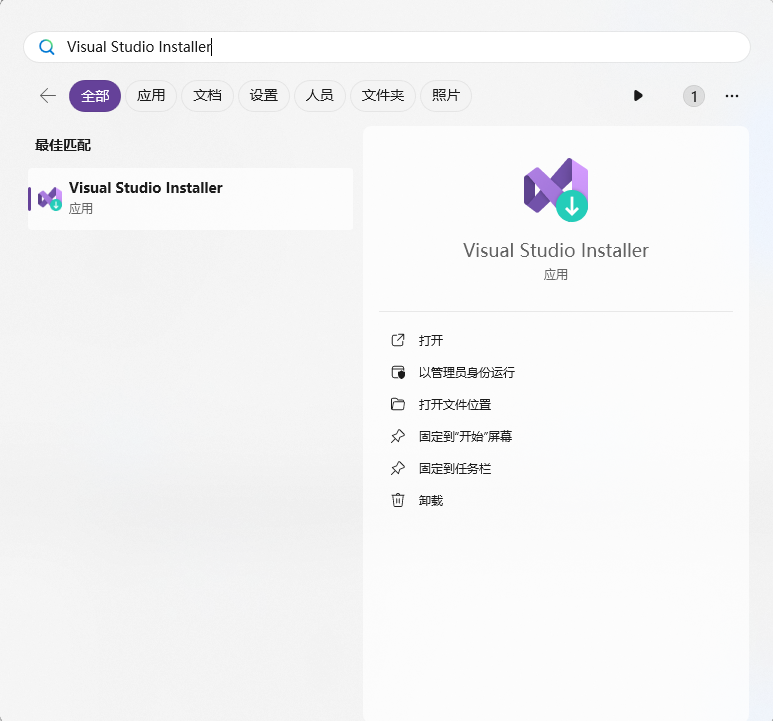

3. 打开`Visual Studio Installer`程序

4. [依赖组件安装](# 依赖组件安装)

#### 依赖组件安装

1. 工作负载勾选`使用C++的桌面开发`

   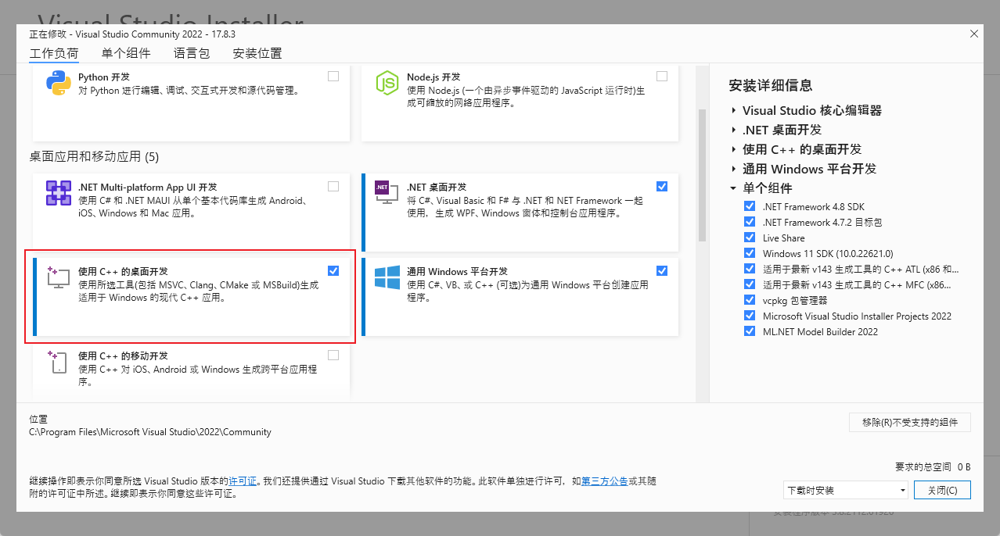

2. 在单个组件中搜索`MFC`,勾选`适用于最新v143生成工具的C++MFC（x86和x64）`

   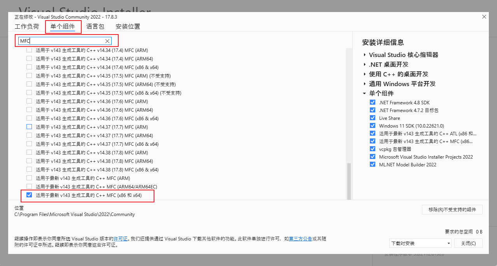

3. 搜索MSVC，勾选`MSVC v143 - VS 2022 C++ x64/x86 生成工具(最新)`

   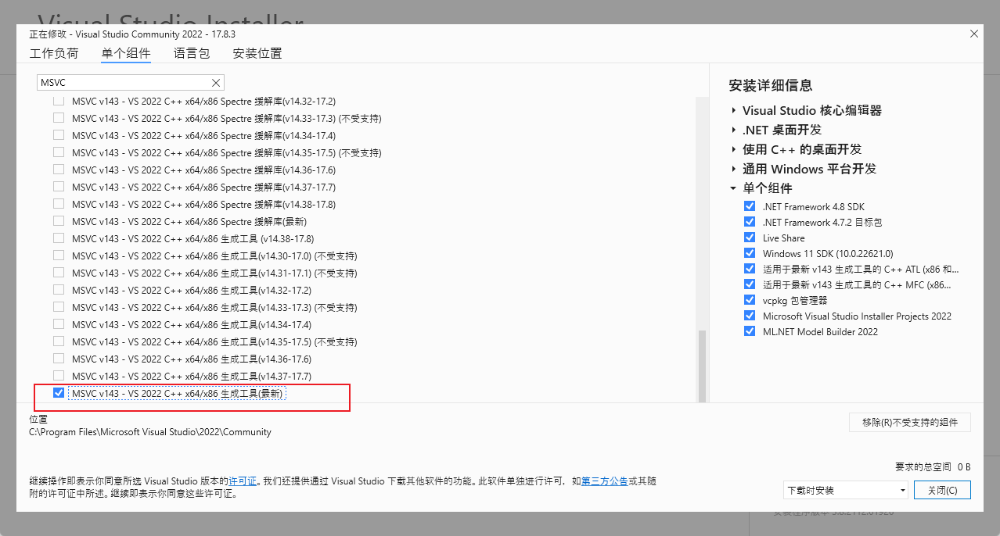

4. 点击修改等待完成

   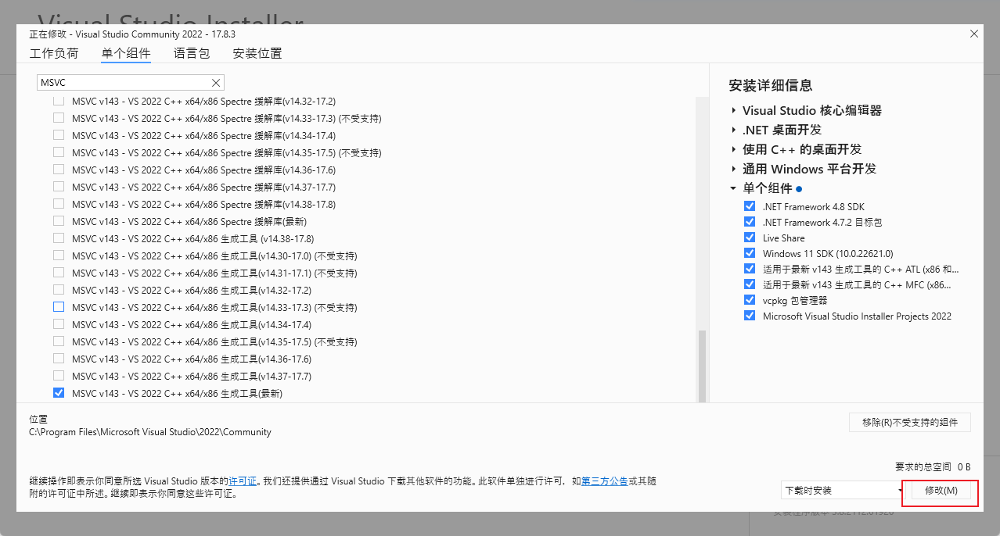


## 二、Chocolately安装

1. 以**管理员权限**运行`powershell`

2. 运行以下代码:

   ``` powershell
   Set-ExecutionPolicy Bypass -Scope Process -Force; [System.Net.ServicePointManager]::SecurityProtocol = [System.Net.ServicePointManager]::SecurityProtocol -bor 3072; iex ((New-Object System.Net.WebClient).DownloadString('https://community.chocolatey.org/install.ps1'))
   ```

3. 测试安装是否成功

   输入 `choco --version` 如果显示版本号则安装成功

   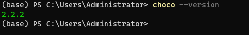

## 三、编译及打包

**<u>！！！源码目录不能包含中文和空格！！！</u>**

### 依赖包安装

1. 以**管理员权限**打开`powershell`, 并按顺序执行一下命令(其中以#开头的为注释，不需要执行)

``` powershell
# 1. 进入源码目录，<src-dir>替换为你的源码路径如：C:\Users\Administrator\Desktop\Roc-Master\roc-master-mfc
cd <src-dir>
# 2. 安装依赖
choco install packages.config -y
choco install cmake --installargs 'ADD_CMAKE_TO_PATH=System' -y # 安装cmake并添加环境变量
```

2. 重新打开powershell

3. 测试PATH是否正常

   ``` powershell
   cmake --version
   ninja --version 
   git --version
   7z t
   iscc --version
   copypedeps --help
   ```

   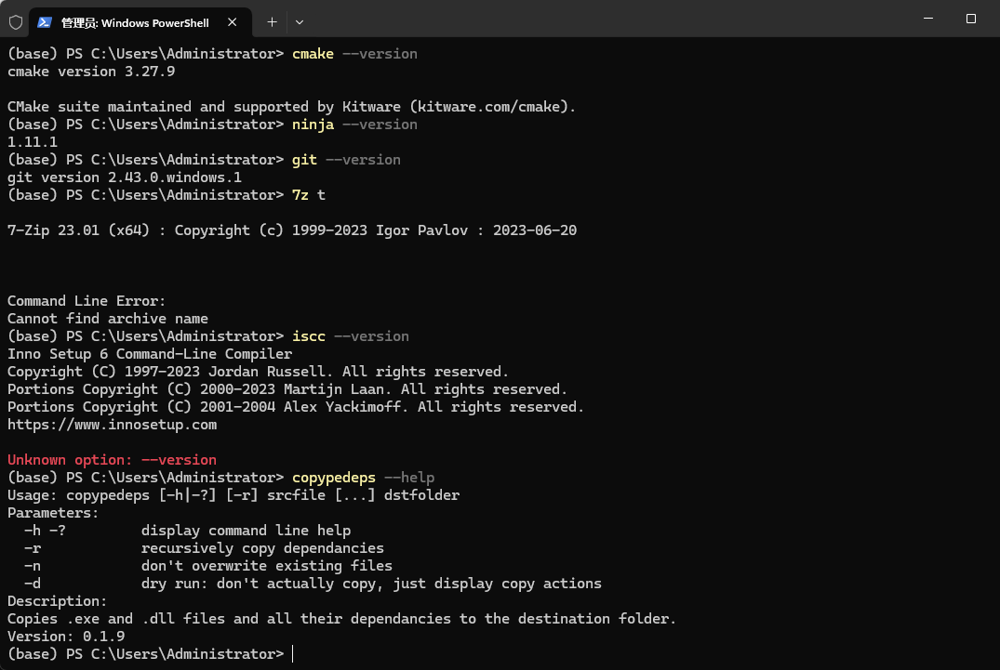

### 程序编译

1. 使用`Visual Studio`打开项目文件

   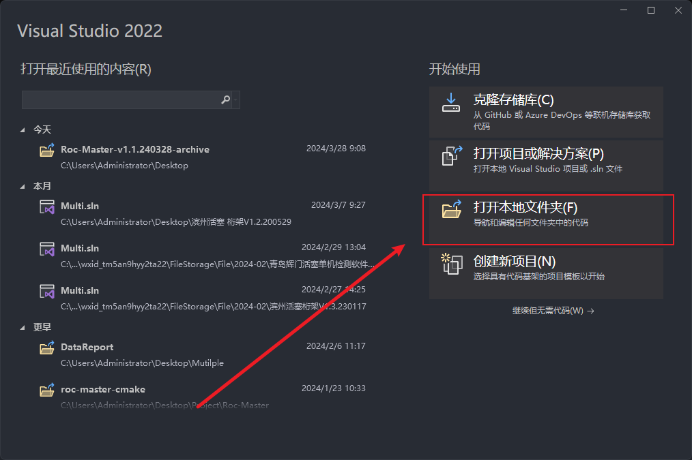

2. 选择`x64 Release`模式

   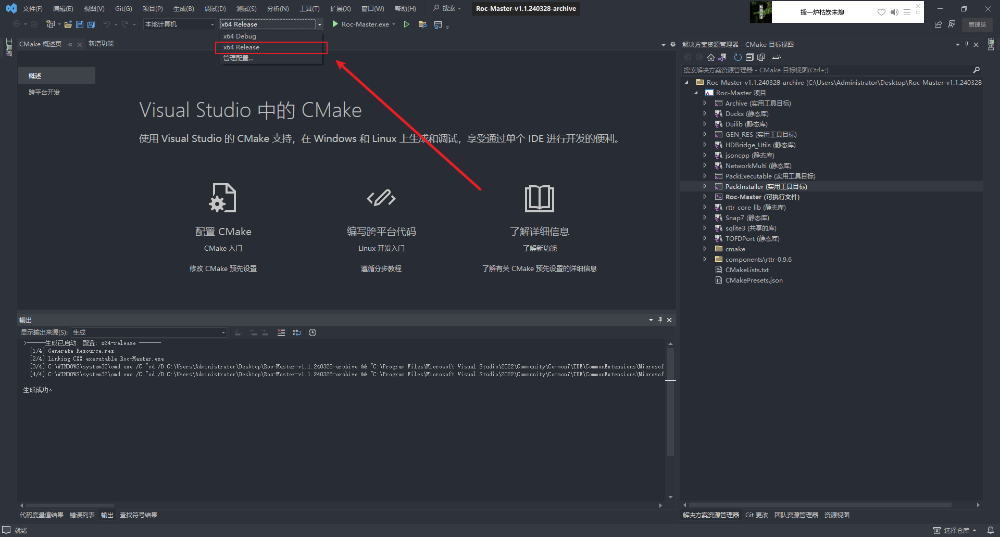

3. 鼠标**右击**`解决方案资源管理器`

   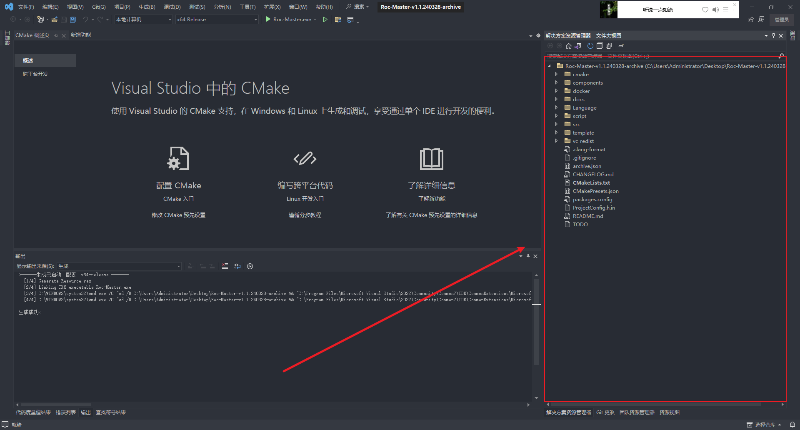

4.点击`切换到CMake目标视图`

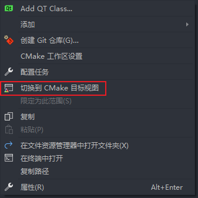

5.**右击**`PackInstaller`

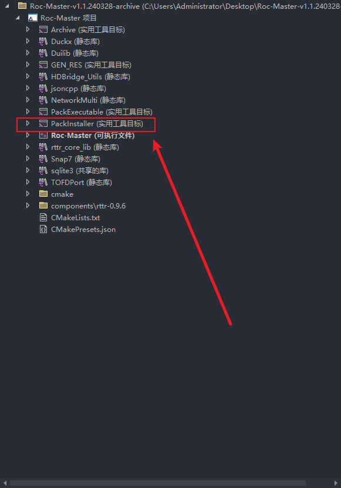

6.点击`生成PackInstaller`

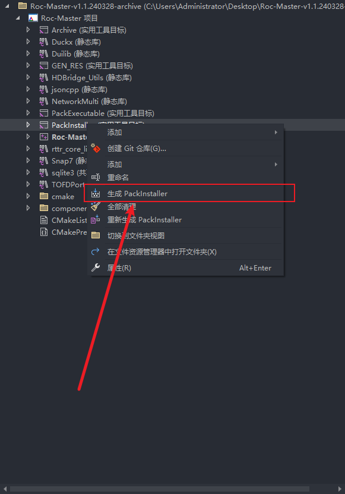

	7. 输出

```shell
output
├── Roc-Master-<version>/ 			  # 免安装包(注意:免安装包仅可以在Win10以上环境运行)
└── Roc-MasterInstaller-<version>.exe # 安装包
```


# 容器构建方案

！！！[构建前须知](# 容器构建使用前须知)

## 启用WSL2

1. 打开控制面板

2. 点击`程序`

   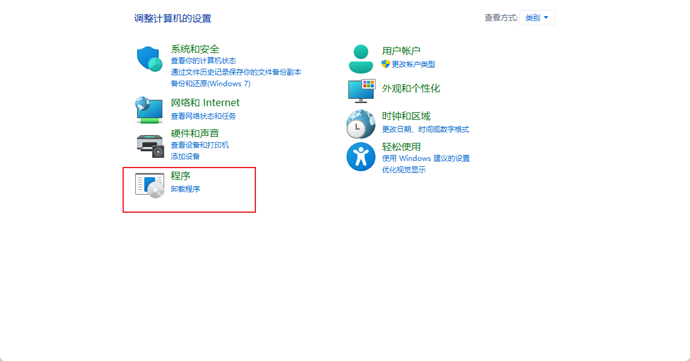

3. 点击`启用或关闭Windows功能`

   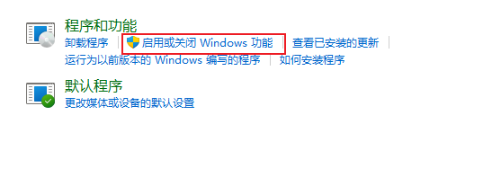

4. 勾选`适用于Linux的Windows子系统`

   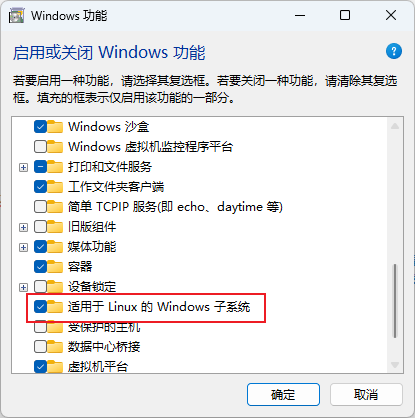

5. 点击确定等待完成后重启计算机

## 安装Docker-Desktop

1. 打开网站[Get Started | Docker](https://www.docker.com/get-started/)

2. 点击`Download for Windows`

3. 安装程序

4. 安装完成并重启后打开`docker`

5. 右键任务栏的docker图标，点击`Switch to Windows containers...`

   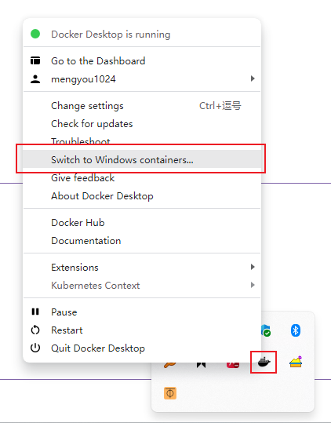

6. 如果弹出警告框则点击`switch`

   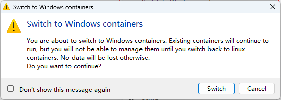

   

## 拉取镜像

打开`powershell`

``` powershell
# 拉取镜像 过程较慢，并且需要C盘内存11G
docker pull mengyou1024/windows11-mfc:latest
```

## 编译打包

在源码目录中打开`powershell`

```powershell
# 1. 进入容器环境
docker run -it --rm  -v "$(pwd):C:\workdir" mengyou1024/windows11-mfc:latest
# 2. 配置
cmake --preset x64-release 
# 3. 编译并打包
cmake --build build/x64-release --target PackInstaller
```


# 项目输出

编译并打包完成后会在源码目录的`output`文件夹下生成`Roc-MasterInstaller-<version>.exe`可执行程序，双击程序即可安装**罗科莱管材探伤机软件**。

# 常见问题

##### 容器构建使用前须知

1. 容器构建依赖WSL2、Docker和CPU的虚拟化技术，如果硬件不支持则不予考虑
2. 容器构建需要C盘剩余空间30G左右，内存敏感则不予考虑
3. 容器镜像约11G左右，拉取时间较长，时间敏感则不予考虑
4. 若以上条件均满足，且不想各种安装包对主机软件环境的影响则优先考虑

##### 主机构建和容器构建对比

|            项目            | 主机构建 | 容器构建 |
| :------------------------: | :------: | :------: |
|        C盘占用情况         | 14G左右  | 25G左右  |
|          编译速度          |  ★★★★★   |  ★★★☆☆   |
|          安装难度          |  ★★★☆☆   |  ★★★★☆   |
|    对主机软件环境的影响    |  ★★★★☆   |  ★☆☆☆☆   |
|          构建难度          |  ★★★☆☆   |  ★★☆☆☆   |
| 无环境从安装到打包完成耗时 |  ★★★☆☆   |  ★★★★★   |
|         修改重编译         |  ★★★★★   |  ★★★☆☆   |

##### 主机构建方案的依赖软件及功能

|    软件    |                             功能                             |
| :--------: | :----------------------------------------------------------: |
| Chocolatey |       软件包管理工具，类似于linux下的apt，用于安装软件       |
|    7zip    |        文件压缩工具，用于压缩源码中和UI相关的资源文件        |
|   cmake    |   跨平台构建工具，项目中用于生成`项目配置文件`和`打包脚本`   |
|    git     |     版本控制工具，项目中使用`git describe`作为软件版本号     |
|   ninja    |                编译工具，类似于linux下的make                 |
| InnoSetup  | 打包工具，将编译输出x64/Release所需要的文件打包为安装包<br />安装过程中会修改注册表，向系统中添加关联的文件格式`.usddb`<br />若不使用打包脚本打包，无法双击打开与软件关联的文件，其余功能无影响 |
|   pedeps   | 依赖库查找工具, 用于搜索编译输出的依赖`dll`文件，并将其拷贝至项目目录 |

