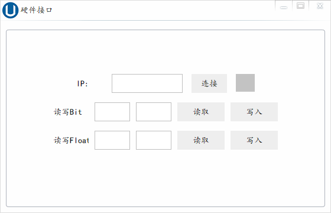

# 目录

* [主界面](# 主界面)
  * [Ⅰ、探头组切换](# Ⅰ、探头组切换)
  * [Ⅱ、扫查/回放](# Ⅱ、扫查/回放)
    * [一、扫查模式](# 一、扫查模式)
      * [1.通道设置](# 1.通道设置)
      * [2.设置界面](# 2.设置界面)
      * [3.硬件接口](# 3.硬件接口)
      * [4.信息录入](# 4.信息录入)
      * [5.测厚功能](# 5.测厚功能)
      
    * [二、回放模式](# 二、回放模式)
      * [1.波形查看](# 1.波形查看)
      * [2.缺陷定位](# 2.缺陷定位)
      * [3.报表导出](# 3.报表导出)

# 主界面

软件打开后主界面如下：

## Ⅰ、探头组切换

如图所示红框所选区域将12个探头分为三组，分别对应1-4、5-8、9-12通道

点击按钮即可切换显示的探头组

## Ⅱ、扫查/回放

这两个按钮对应软件的两种工作模式(扫查模式和回放模式)，软件正常打开默认进入扫查模式，若软件是由双击扫查文件打开则会进入回放模式

### 一、扫查模式

#### 1.通道设置

扫查模式下，可对各个通道的参数进行设置，可以通过**拖动滚动条**、**单击滚动条后滚动鼠标滚轮**、**在输入框中输入数值再按回车健**或者**单击输入框后滚动鼠标滚轮**进行设置。

另外**鼠标左键双击A扫图**会打开更详细的通道参数设置：

设置分为两部分区域：

> 板卡参数: 这部分参数，所有通道公用
>
> 通道参数: 这部分参数，各个通道独立

##### 通道拷贝

勾选通道后，点击通道拷贝按钮，会将**当前打开的通道**的**通道参数**拷贝至**勾选的通道**。

#### 2.设置界面

目前设置界面仅可对两项功能进行设置

1. 使用网口，勾选后超声板不再使用`USB`通信，转而使用网口

> 注意：默认的本机`IP`为`192.168.1.100`, 端口为`4200`, 板卡`IP`为`192.168.1.110`, 端口为`3500`
2. 勾选测厚选项框，可开启测厚功能

#### 3.硬件接口

硬件接口目前用于调试`PLC`, 读写前请先连接至`PLC`

#### 4.信息录入

信息录入是用于保存探伤信息，以便报表导出。

#### 5.测厚功能

[开启测厚功能](# 2.设置界面)后调整**B波门**及**测厚波门**的位置即可。

框选部分即为测厚结果

### 二、回放模式

##### ①从主界面进入

在主界面中点击回放模式按钮会弹出一个数据选择对话框，需要根据时间日期选择探伤数据文件

选择完成后点击确定即可进入回放模式。

##### ② 通过绑定的文件格式进入

通过安装程序安装的软件会绑定以`.usddb`结尾的文件，双击打开这类文件即可进入扫查界面。

#### 1.波形查看

左键单击红框区域可以选择扫查数据进行查看

#### 2.缺陷定位

双击这部分区域可以打开缺陷列表，选中缺陷列表后点击确定案例可以快速定位到缺陷数据

#### 3.报表导出

点击**报表导出按钮**可以导出探伤记录的报表。

