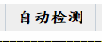

# 目录

* [主界面](# 主界面)
  * [Ⅰ、探头组切换](# Ⅰ、探头组切换)
  * [Ⅱ、扫查/回放](# Ⅱ、扫查/回放)
    * [一、扫查模式](# 一、扫查模式)
      * [1.通道设置](# 1.通道设置)
      * [2.设置界面](# 2.设置界面)
        * [① 开启测厚功能](# ① 开启测厚功能)
        * [② 步进距离调整(v1.1.4新增)](# ② 步进距离调整(v1.1.4新增))
      * [3.自动检测](# 3.自动检测)
      * [4.参数管理](# 4.参数管理)
      * [5.硬件接口](# 5.硬件接口)
      * [6.信息录入](# 6.信息录入)
      * [7.声速校准](# 7.声速校准)
      * [8.峰值记忆、波形冻结、追踪使能](# 8.峰值记忆、波形冻结、追踪使能)
        * [①峰值记忆](# ①峰值记忆)
        * [②波形冻结](# ②波形冻结)
        * [③追踪使能](# ③追踪使能)
    * [二、回放模式](# 二、回放模式)
      * [1.波形查看](# 1.波形查看)
      * [2.缺陷定位](# 2.缺陷定位)
      * [3.报表导出](# 3.报表导出)

# 主界面

软件打开后主界面如下：

## Ⅰ、探头组切换

如图所示红框所选区域将12个探头分为三组，分别对应1-4、5-8、9-12通道

点击按钮即可切换显示的探头组

## Ⅱ、扫查/回放

这两个按钮对应软件的两种工作模式(扫查模式和回放模式)，软件正常打开默认进入扫查模式，若软件是由双击扫查文件打开则会进入回放模式

### 一、扫查模式

#### 1.通道设置

扫查模式下，可对各个通道的参数进行设置，可以通过**拖动滚动条**、**单击滚动条后滚动鼠标滚轮**、**在输入框中输入数值再按回车健**或者**单击输入框后滚动鼠标滚轮**进行设置。

另外**鼠标左键双击A扫图**会打开更详细的通道参数设置：

设置分为两部分区域：

> 板卡参数: 这部分参数，所有通道公用
>
> 通道参数: 这部分参数，各个通道独立

##### 通道拷贝

勾选通道后，点击通道拷贝按钮，会将**当前打开的通道**的**通道参数**拷贝至**勾选的通道**。

#### 2.设置界面

目前设置界面仅可对两项功能进行设置

使用网口，勾选后超声板不再使用`USB`通信，转而使用网口

> 注意：默认的本机`IP`为`192.168.1.100`, 端口为`4200`, 板卡`IP`为`192.168.1.110`, 端口为`3500`
##### ① 开启测厚功能

勾选测厚选项框，可开启测厚功能

[开启测厚功能](# 2.设置界面)后调整**B波门**及**测厚波门**的位置即可。

框选部分即为测厚结果

##### ② 步进距离调整(v1.1.4新增)

v1.1.4版本以后新增步进距离调整，直接在输入框中**输入**或者**滚动鼠标滚轮**即可

> 步进距离用于控制线扫图的采样周期
>
> 在X轴移动步进距离(T)的长度内，软件会计算**扫查波门**内波副**最高值**，
>
> 当达到T后会记录时间段内**扫查波门最高波幅**的A扫图，同时在线扫图上绘制一个点

#### 3.自动检测

当设备处于**手动模式**下，扫查需要点击自动检测按钮，结束时再次点击自动检测按钮

当设备处**于自动模式**下，扫查按钮不需要手动点击，由`PLC`的自动开始按钮**自动启停**

#### 4.参数管理

参数管理用于保存探伤的**工艺信息**

默认情况下，软件会保存退出时的工艺信息于上一次配置中，

如果需要保存工艺信息，可以点击**新建**按钮创建扫查参数，然后选中创建的参数名称点击写入

**删除按钮**表示将当前选中的配置参数删除

**读取按钮**表示从选中的配置参数读取并替换当前的配置参数

**写入按钮**表示将当前的配置参数写入到园中的配置参数中

****

#### 5.硬件接口

硬件接口目前用于调试`PLC`, 读写前请先连接至`PLC`

> 黄色区域为连接状态指示，当输入正确的PLC地址并点击连接后，该区域会变为**绿色**， 否则则表示连接失败。
>
> 红色区域为**数据地址**输入框，可以输入的格式有：I1.0、Q1.0、M1.0、V1.0(1表示DB块的索引)
>
> 绿色区域为从`PLC`读取的值或者想要写入`PLC`里面的值

#### 6.信息录入

信息录入是用于保存探伤信息，以便报表导出。

#### 8.峰值记忆、波形冻结、追踪使能

##### ①峰值记忆

> 峰值记忆会将所以通道所有波门内的最高值显示到界面上

##### ②波形冻结

> 波形冻结会暂停当前的扫查程序

##### ③追踪使能

> 追踪使能使用前需要将A波门，放置于水程波的位置，当水程波发生移动时，**当前通道**的**所有波门**跟随移动
>
> 目前追踪使能仅用于[测厚功能](# 9.测厚功能)的4个通道

④自动增益

> 自动增益使用前需要选择正确的**通道及波门**
>
> 
>
> 
>
> 点击自动增益后，会将选中的波门内最高回波的波幅调整至80%

#### 7.声速校准

软件版本`V1.1.3`以后添加**声速校准**功能，

该功能使用1通道的A波门和C(扫查或测厚)波门，A波门放置于**水程波**位置，C波门放置于**底波**位置，点击功能按钮后根据提示输入**实际工件厚度**即可。

其余通道可以使用[通道拷贝](# 通道拷贝)功能，拷贝声速。

>  注: 声速校准尽量在调整好各个通道参数之前完成，放置通道参数在通道拷贝时被覆盖。

### 二、回放模式

##### ①从主界面进入

在主界面中点击回放模式按钮会弹出一个数据选择对话框，需要根据时间日期选择探伤数据文件

v1.1.4版本以后数据选择界面更改为如下形式:

选择完成后点击确定即可进入回放模式。

##### ② 通过绑定的文件格式进入

通过安装程序安装的软件会绑定以`.usddb`结尾的文件，双击打开这类文件即可进入扫查界面。

#### 1.波形查看

左键单击红框区域可以选择扫查数据进行查看

#### 2.缺陷定位

双击这部分区域可以打开缺陷列表，选中缺陷列表后点击确定案例可以快速定位到缺陷数据

#### 3.报表导出

点击**报表导出按钮**可以导出探伤记录的报表。

